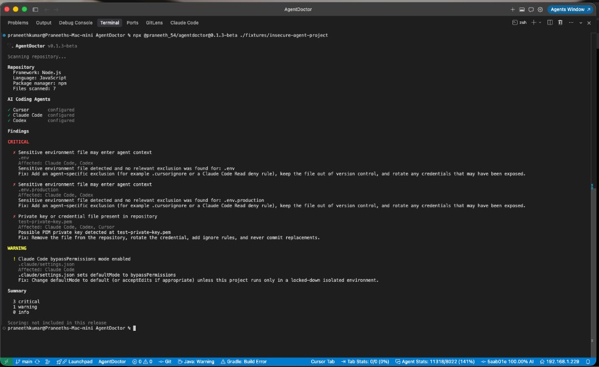

# AgentDoctor

[](https://www.npmjs.com/package/@praneeth_54/agentdoctor)
[](https://www.npmjs.com/package/@praneeth_54/agentdoctor)
[](https://github.com/pranee54/AgentDoctor/actions)
[](https://nodejs.org)
[](LICENSE)

**Lighthouse for AI coding agents.**

Audit coding-agent configuration before it becomes a repository problem.

AgentDoctor is a local CLI that inspects project-level AI coding agent setup — Cursor, Claude Code, and Codex — for security, instructions, context, and MCP configuration. Deterministic static analysis. No API key. No code upload by default.

```bash
npx @praneeth_54/agentdoctor
```

Public beta (`0.1.x-beta`). Deterministic readiness scores ship in JSON; automatic fixes are not available yet.

---

## What you get



_Real scan of the included `insecure-agent-project` fixture using AgentDoctor v0.2.0-beta._

```text
$ npx @praneeth_54/agentdoctor

🩺 AgentDoctor v0.2.0-beta

Scanning repository...

Repository
  Framework: Node.js
  Language: JavaScript
  Package manager: npm
  Files scanned: 7

AI Coding Agents

✓ Cursor       configured
✓ Claude Code  configured
✓ Codex        configured

Findings

CRITICAL

  ✗ Sensitive environment file may enter agent context
    .env
    Affected: Claude Code, Codex
    Fix: Add an agent-specific exclusion (for example .cursorignore or a
         Claude Code Read deny rule), keep the file out of version control,
         and rotate any credentials that may have been exposed.

  ✗ Private key or credential file present in repository
    test-private-key.pem
    Affected: Claude Code, Codex, Cursor

WARNING

  ! Claude Code bypassPermissions mode enabled
    .claude/settings.json

Summary

  3 critical
  1 warning
  0 info

Scoring: not included in this release
```

Abbreviated text example from the same fixture for accessibility and search. Secret values are never printed.

---

## Why AgentDoctor?

Repositories accumulate agent configuration quickly:

- Multiple instruction formats (`.cursor/rules`, `CLAUDE.md`, `AGENTS.md`)
- Stale path references in always-on instructions
- Ignore differences between `.gitignore`, `.cursorignore`, and agent defaults
- MCP filesystem scopes that are broader than intended
- Generated directories and large logs that waste context
- Credential-like files that may be readable by agents
- Conflicting assumptions about what each agent can see

Manually reviewing all of that across Cursor, Claude Code, and Codex is slow and inconsistent. AgentDoctor provides one deterministic local audit with stable rule IDs, evidence paths, and affected-agent information.

| Analogy         | Domain                           |
| --------------- | -------------------------------- |
| Lighthouse      | Web pages                        |
| `npm audit`     | Dependencies                     |
| ESLint          | Source code                      |
| **AgentDoctor** | **AI coding agent environments** |

AgentDoctor analyzes configuration. It does not run agents, call an LLM, or modify your repository in this release.

---

## Before / after

**Before**

A repository may contain:

```text
.cursor/rules/
AGENTS.md
CLAUDE.md
.claude/settings.json
.mcp.json
.env
```

Potential problems stay invisible until something leaks into model context, CI, or a teammate’s agent session:

- environment or credential-like files reachable by agents
- stale instruction path references
- broad MCP filesystem access
- oversized always-on context

**Run**

```bash
npx @praneeth_54/agentdoctor
```

**After**

You get deterministic findings with:

- stable rule IDs (for example `security/env-file-exposure`)
- evidence paths
- affected agents when exposure claims are supported
- conservative recommendations

Automatic repair is **not** included in this beta. Findings tell you what to review; you decide what to change.

---

## Quick start

### One-shot (recommended)

```bash
npx @praneeth_54/agentdoctor
```

Pin a beta version when you need a fixed install:

```bash
npx @praneeth_54/agentdoctor@0.2.0-beta
```

### Global (optional)

```bash
npm install -g @praneeth_54/agentdoctor
agentdoctor
```

### Common commands

```bash
agentdoctor .
agentdoctor . --json
agentdoctor . --verbose
agentdoctor explain security/env-file-exposure
agentdoctor doctor
```

Package name: `@praneeth_54/agentdoctor` (npm blocks the unscoped name). CLI binary: `agentdoctor`. Requires **Node.js 20+**.

### Programmatic API

```bash
npm install @praneeth_54/agentdoctor
```

```ts
import { scan } from "@praneeth_54/agentdoctor";

const result = await scan({ cwd: process.cwd() });
console.log(result.summary);
console.log(result.agentSecurityAnalysis); // "full" | "limited"
```

---

## Supported agents

Project-level configuration only (repository files). Global user settings are not scanned.

| Agent           | What AgentDoctor inspects                                              |
| --------------- | ---------------------------------------------------------------------- |
| **Cursor**      | `.cursor/rules/*.mdc`, `.cursorignore`, Cursor MCP config, `AGENTS.md` |
| **Claude Code** | `CLAUDE.md`, `.claude/settings*.json`, `.claude/rules`, MCP config     |
| **Codex**       | `AGENTS.md` / overrides, project `.codex/` configuration               |

Additional adapters are planned — see [ROADMAP.md](ROADMAP.md).

---

## Finding categories

| Category         | Examples                                                              |
| ---------------- | --------------------------------------------------------------------- |
| **Security**     | Env-file exposure, private-key filenames, broad MCP filesystem scopes |
| **Context**      | Large instruction files, large logs, unignored generated directories  |
| **Instructions** | Empty instructions, duplicate content, missing path references        |
| **MCP**          | Malformed MCP config, high-risk filesystem path arguments             |

Full catalog with severities and fixability: [docs/rules.md](docs/rules.md).

Explain any rule:

```bash
npx @praneeth_54/agentdoctor explain security/env-file-exposure
```

---

## Privacy and trust

**Scans run locally on your machine.**

AgentDoctor:

- does not require an API key
- does not upload repository contents by default
- does not call an LLM for core scanning
- does not execute MCP servers
- does not execute project code
- never prints secret values from files it flags by name
- enforces repository boundary checks for path references and symlink escape

This is still software that reads untrusted repository trees. Treat findings as guidance, not a security certification. AgentDoctor is **not** a complete secret-content scanner.

---

## CI usage

### GitHub Action

Run AgentDoctor directly in a workflow:

```yaml
permissions:
  contents: read

steps:
  - uses: actions/checkout@v4

  - name: Audit coding-agent configuration
    id: agentdoctor
    uses: pranee54/AgentDoctor@v0.2.0-beta
    with:
      path: .
      output-file: agentdoctor-report.json

  - name: Upload AgentDoctor report
    uses: actions/upload-artifact@v4
    with:
      name: agentdoctor-report
      path: ${{ steps.agentdoctor.outputs.report-path }}
```

The action installs the published `@praneeth_54/agentdoctor@0.2.0-beta` package, runs it with
`--ci --json`, and writes the report inside the checked-out workspace. It sets up Node.js 20
for the CLI. The optional `version` input accepts an exact npm version or the `latest` / `beta`
dist-tag.

### CLI

Use JSON directly in other CI systems:

```bash
# Report-only (exit 0 even when findings exist; scores still in JSON)
npx @praneeth_54/agentdoctor --ci --json

# Fail CI when overall readiness is below 70
npx @praneeth_54/agentdoctor --ci --json --min-score 70
```

`--ci` runs non-interactively and does **not** apply an implicit score threshold.
Use `--min-score N` (with or without `--ci`) to fail with exit code `1` when
`scores.overall < N`.

Exit codes: [docs/exit-codes.md](docs/exit-codes.md). Compatibility promises: [docs/compatibility.md](docs/compatibility.md).

### Readiness scoring

Scans populate `scoringAvailable: true` and a deterministic `scores` object
(overall, categories, agents). The terminal report does not render a readiness line yet;
scores are available in JSON (`--json`).

`--min-score N` is enforced by the CLI. Details (weights, security caps, threshold rules,
and deferred v2 items): [docs/scoring.md](docs/scoring.md).

---

## Beta limitations

Honest limits of the current public beta:

| Limitation                          | Status                                                          |
| ----------------------------------- | --------------------------------------------------------------- |
| Terminal readiness line             | Scores ship in JSON only; terminal does not print N/100 yet     |
| GitHub Action score gates           | Action remains `--ci --json` report-only (no `min-score` input) |
| Automatic fixes (`agentdoctor fix`) | Stub only — does not modify files                               |
| Secret-content scanning             | Filename / config heuristics only                               |
| Detection style                     | Intentionally conservative; false security findings are avoided |
| Agent coverage                      | Cursor, Claude Code, Codex project configs                      |

See [CHANGELOG.md](CHANGELOG.md) and [docs/release-notes-v0.2.0-beta.md](docs/release-notes-v0.2.0-beta.md).

---

## Architecture

```text
Discovery → Project detect → Agent adapters → Rule engine → Findings → Scores → Terminal / JSON
```

Details: [docs/architecture.md](docs/architecture.md)

---

## Documentation

| Doc                                                                | Contents                        |
| ------------------------------------------------------------------ | ------------------------------- |
| [docs/README.md](docs/README.md)                                   | Documentation index             |
| [docs/architecture.md](docs/architecture.md)                       | Scan pipeline                   |
| [docs/rules.md](docs/rules.md)                                     | Stable rule IDs                 |
| [docs/exit-codes.md](docs/exit-codes.md)                           | Process exit codes              |
| [docs/scoring.md](docs/scoring.md)                                 | Readiness scoring specification |
| [docs/compatibility.md](docs/compatibility.md)                     | Beta compatibility promises     |
| [docs/development.md](docs/development.md)                         | Local development               |
| [docs/github-launch-checklist.md](docs/github-launch-checklist.md) | GitHub About / topics / launch  |
| [ROADMAP.md](ROADMAP.md)                                           | Near- and medium-term plans     |
| [CHANGELOG.md](CHANGELOG.md)                                       | Release history                 |

---

## Contributing

Issues and pull requests are welcome.

1. Read [CONTRIBUTING.md](CONTRIBUTING.md) and the [Code of Conduct](CODE_OF_CONDUCT.md)
2. Prefer [good first issues](docs/good-first-issues.md) ideas
3. Report security issues via [SECURITY.md](SECURITY.md) — never paste real secrets into issues

```bash
git clone https://github.com/pranee54/AgentDoctor.git
cd AgentDoctor
npm install
npm run verify
node dist/cli/index.js ./fixtures/clean-configured-project
```

---

## Next steps

- **Try it:** `npx @praneeth_54/agentdoctor`
- **Report a false positive / false negative:** use the issue templates (include version, rule ID, anonymized evidence — no secrets)
- **Propose a rule or adapter:** [feature request](.github/ISSUE_TEMPLATE/feature_request.md) / [rule proposal](.github/ISSUE_TEMPLATE/rule_proposal.md)
- **Contribute:** [CONTRIBUTING.md](CONTRIBUTING.md)
- **Useful?** Star or watch the repository so you see updates

---

## License

[MIT](LICENSE) © AgentDoctor Contributors
