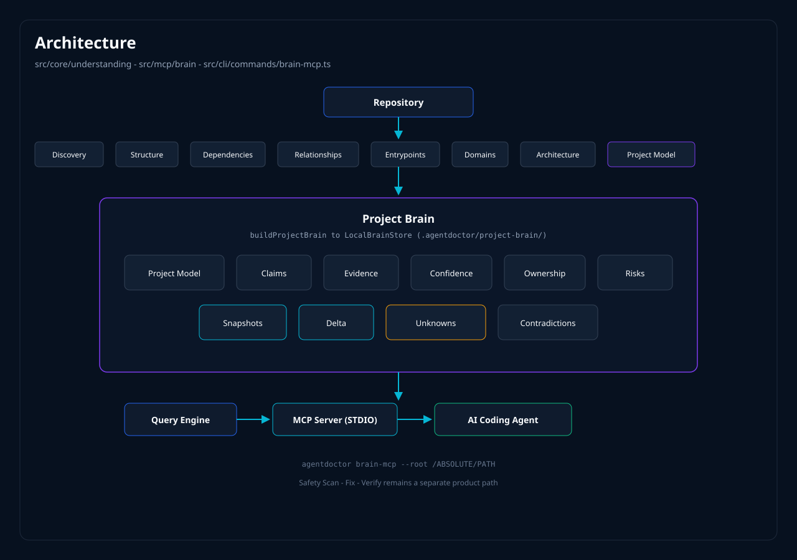
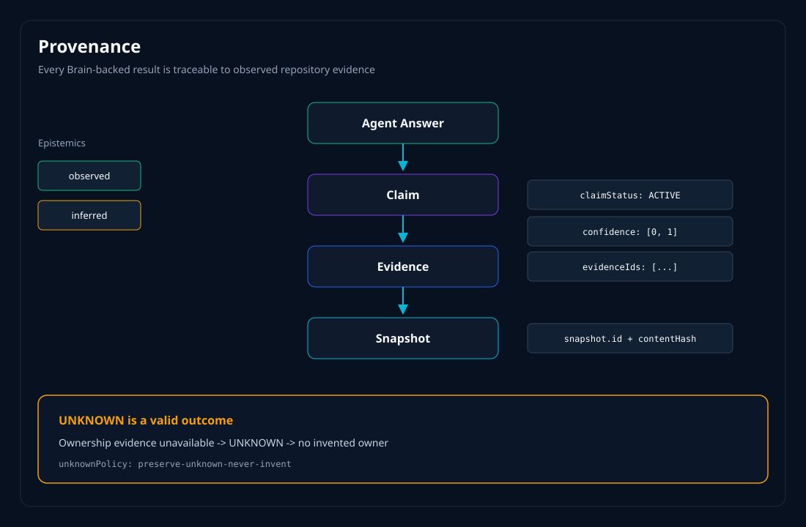
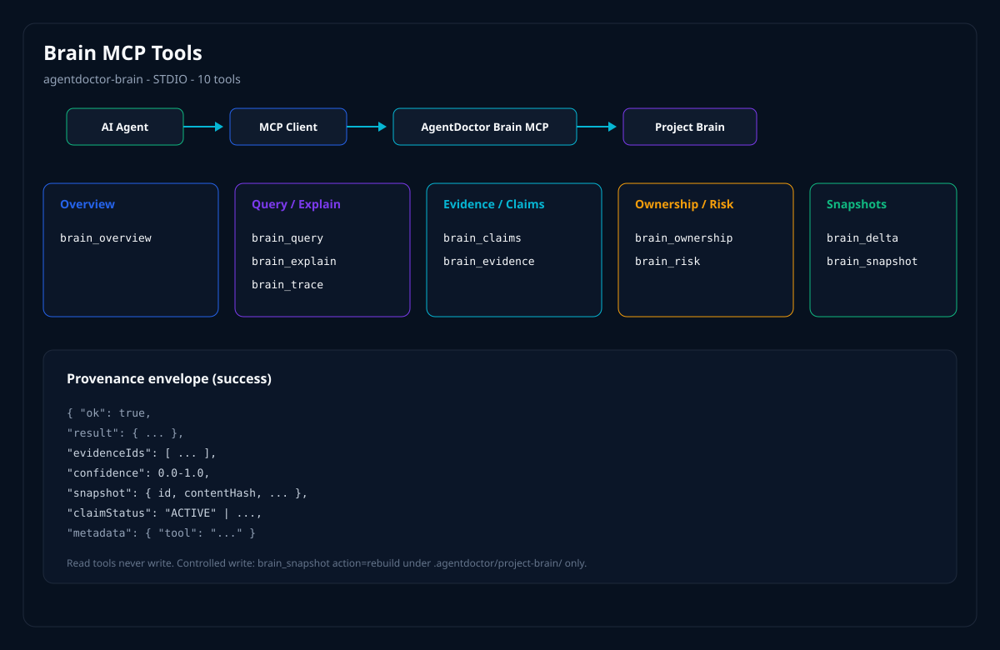
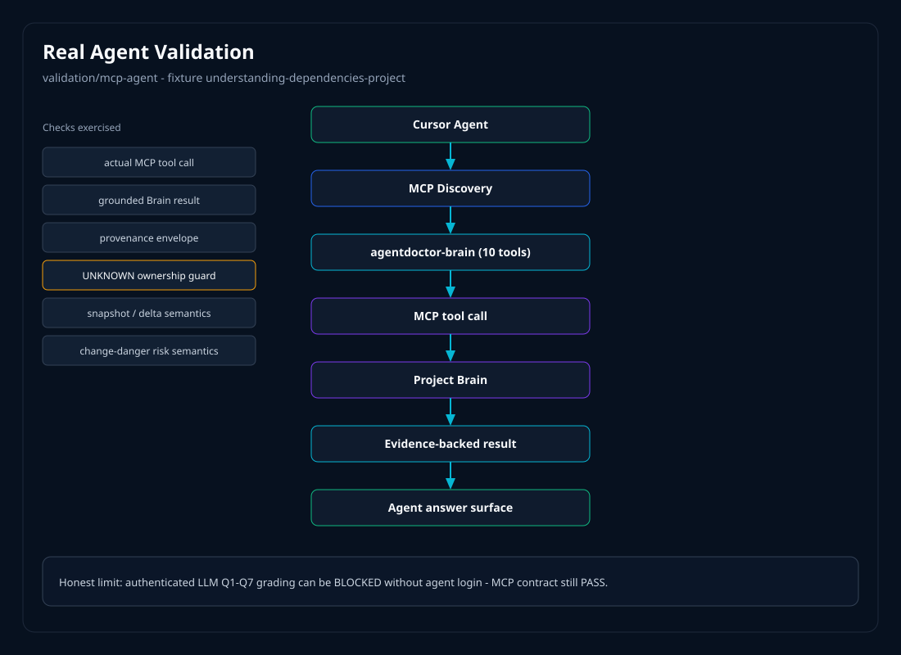
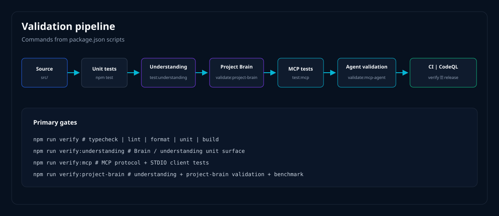

# AgentDoctor

Evidence-backed Project Brain for AI Coding Agents


AI coding agents can read files. They still lack reliable **repository-level** understanding — what is in a project, what evidence supports a claim, what is dangerous to change, and what must stay **UNKNOWN**.

AgentDoctor analyzes a repository, builds a structured **Project Brain** (claims, evidence, confidence, ownership, risks, snapshots, deltas), and exposes it to agents through local **STDIO MCP**.

[](https://www.npmjs.com/package/@praneeth_54/agentdoctor)
[](https://github.com/pranee54/AgentDoctor/actions/workflows/ci.yml)
[](https://nodejs.org)
[](LICENSE)

[Documentation](docs/README.md) · [Project Brain](docs/project-brain.md) · [MCP](docs/mcp/brain-mcp.md) · [GitHub Action](#github-action) · [Demo](docs/demo/brain-mcp-demo.md) · [Security](SECURITY.md) · [Roadmap](ROADMAP.md)

```text
Repository
   ↓
Project Understanding
   ↓
Project Brain
   ↓
Evidence / Claims / Confidence
   ↓
MCP
   ↓
AI Coding Agent
```

Also ships **Safety V1**: Scan → Fix → Verify → Policy → CI for Cursor, Claude Code, and Codex configuration. Brain risk is **change-danger analysis**, not vulnerability scanning.

---

## What is AgentDoctor?

Local developer infrastructure for AI coding agents (`@praneeth_54/agentdoctor`, CLI `agentdoctor`, **1.1.0**, Node.js **20+**).

It:

- analyzes repositories with deterministic discovery passes
- builds a structured Project Brain
- represents claims with typed evidence and confidence
- preserves **UNKNOWN** when evidence is missing
- persists snapshots and computes deltas
- exposes Brain capabilities through MCP (`agentdoctor brain-mcp --root <path>`)

It is **not** an autonomous coding agent, chatbot, RAG memory product, AGI claim, or vulnerability scanner. It does not claim universal or perfect repository understanding.

---

## Why Project Brain?

Agents edit with fragmented context. Ownership gets invented. Blast radius stays implicit. “Why should I trust that?” rarely has an answer with a snapshot id.

Project Brain structures understanding that exists in this codebase:

architecture · domains · components · entrypoints · dependencies · relationships · ownership · change-danger risks · claims · evidence · confidence · snapshots · deltas

Details: [docs/project-brain.md](docs/project-brain.md)

---

## Architecture



| Layer                     | Location                                                    |
| ------------------------- | ----------------------------------------------------------- |
| Understanding / discovery | `src/core/understanding/`                                   |
| Project Brain             | `src/core/understanding/brain/`                             |
| MCP bridge                | `src/mcp/brain/`                                            |
| CLI                       | `src/cli/commands/brain-mcp.ts`                             |
| Safety (separate path)    | `src/core/{scanner,rules,fix,verify,policy}/`, `action.yml` |

MCP depends on Brain. Brain does not depend on MCP.

---

## Project Brain



### Evidence & provenance

```text
Claim
  ↓
Evidence
  ↓
Snapshot
```

Successful MCP tools return a provenance envelope: `result`, `evidenceIds`, `confidence` (`[0,1]`, rule-derived / uncalibrated), `snapshot` (`id` + `contentHash`), and `claimStatus` when applicable.

Claim lifecycle: `ACTIVE` · `INVALIDATED` · `SUPERSEDED` · `CONTRADICTED`

Epistemics on evidence: `observed` | `inferred`. ACTIVE claims must reference evidence. Serialization redacts secret-like values.

### UNKNOWN semantics

```text
Ownership evidence unavailable
        ↓
     UNKNOWN
```

No invented owners. Contract: `preserve-unknown-never-invent`.

Local runtime store (not committed product source): `<repo>/.agentdoctor/project-brain/`.

---

## MCP



```text
AI Coding Agent → MCP client → agentdoctor brain-mcp --root <abs> → Project Brain
```

STDIO only. No API key. No upload. `--root` is required. Diagnostics on **stderr**; protocol on **stdout**.

### Tools (from `src/mcp/brain/tools/registry.ts`)

| Tool              | Purpose                                                |
| ----------------- | ------------------------------------------------------ |
| `brain_overview`  | Compact summary + confidence envelope                  |
| `brain_query`     | Typed `BrainQueryEngine` queries                       |
| `brain_explain`   | Evidence-backed `explainClaim`                         |
| `brain_trace`     | Capped deterministic `traceBrain`                      |
| `brain_claims`    | Claim lifecycle (default ACTIVE + CONTRADICTED)        |
| `brain_evidence`  | Typed redacted evidence                                |
| `brain_ownership` | Explicit CODEOWNERS / MAINTAINERS / package only       |
| `brain_risk`      | Change-danger risk (not SAST / CVE)                    |
| `brain_delta`     | Read-only snapshot comparison                          |
| `brain_snapshot`  | `current` · `history` · `compare` · `load` · `rebuild` |

Only controlled write: `brain_snapshot` `rebuild` under `<root>/.agentdoctor/project-brain/`.

Contract: [docs/mcp/brain-mcp.md](docs/mcp/brain-mcp.md)

---

## Real Cursor Agent Validation



```text
Cursor Agent
    ↓
MCP discovery (agentdoctor-brain)
    ↓
brain_* tool call
    ↓
Project Brain
    ↓
Evidence-backed result (+ provenance)
```

Harness: `validation/mcp-agent` on `fixtures/understanding-dependencies-project`.

| Q   | Focus          | Expected tools                                    |
| --- | -------------- | ------------------------------------------------- |
| Q1  | Overview       | `brain_overview`                                  |
| Q2  | Entrypoints    | `brain_query`                                     |
| Q3  | Change risk    | `brain_risk`                                      |
| Q4  | Ownership      | `brain_ownership`                                 |
| Q5  | Impact / trace | `brain_trace`                                     |
| Q6  | Provenance     | `brain_explain`, `brain_claims`, `brain_evidence` |
| Q7  | Delta          | `brain_delta`, `brain_snapshot`                   |

Documented harness results ([validation/mcp-agent/README.md](validation/mcp-agent/README.md), 2026-08-13, AgentDoctor 1.1.0):

- Deterministic Brain tool exercise: **10/10** succeeded (actual tool calls, not prose inference)
- Cursor MCP tools discovered: **PASS** (all 10 listed)
- Security checks: **10/10**
- Provenance (tool-level): **PASS**
- Authenticated LLM Q1–Q7 grading: **BLOCKED** without agent login — kept separate from MCP contract PASS

Checks include grounding, UNKNOWN ownership guard, risk semantics, provenance, snapshot/delta semantics — not “zero hallucinations.”

Demo: [docs/demo/brain-mcp-demo.md](docs/demo/brain-mcp-demo.md)

---

## Built Through Real Validation

1.1.0 was hardened under real MCP, CI, and Windows pressure — not README theater.

| Problem                      | What we learned                                                                                                                                                                                                              |
| ---------------------------- | ---------------------------------------------------------------------------------------------------------------------------------------------------------------------------------------------------------------------------- |
| MCP cold start               | Session loads latest snapshot or, by default, **compiles on first connect** (`buildIfMissing`). Large roots make host MCP timeouts more likely — prefer an existing snapshot / explicit `rebuild` before attaching an agent. |
| Large Brain init             | First compile writes under `.agentdoctor/project-brain/`; local Brain state ≠ committed source.                                                                                                                              |
| STDIO discipline             | Protocol on stdout only; logs on stderr (`src/mcp/brain/server.ts`, `tests/unit/mcp/`).                                                                                                                                      |
| Cross-process MCP tests      | Unit STDIO client + protocol tests matter more than assuming tool use from answer quality.                                                                                                                                   |
| Windows CLI                  | `.cmd` / POSIX shim pitfalls → invoke via `node` + `npm-cli.js`; native `cmd` quoting.                                                                                                                                       |
| Argument escaping            | CodeQL-driven hardening of Windows command argument escaping in test helpers.                                                                                                                                                |
| CI matrix                    | Ubuntu + Windows quality job; Project Brain laboratory requires `npm run build` before spawn (`f3cd550`).                                                                                                                    |
| Snapshots                    | Atomic writes, checksum fail-closed, refuse divergent overwrite of the same snapshot id.                                                                                                                                     |
| Terminal / injection surface | Findings must not become escape channels; Security policy calls out terminal escape injection.                                                                                                                               |
| UNKNOWN                      | Inventing ownership is a product failure mode.                                                                                                                                                                               |

---

## Repository Structure


```text
src/
├── core/
│   └── understanding/          # discovery + Project Brain
├── mcp/
│   └── brain/                  # STDIO MCP bridge
└── cli/
    └── commands/
        └── brain-mcp.ts

tests/
└── unit/
    ├── understanding/
    └── mcp/

validation/
├── project-brain/
├── software-understanding/
├── real-world/
└── mcp-agent/

docs/
├── assets/                     # README diagrams (this landing page)
├── mcp/
├── demo/
└── project-brain.md

examples/mcp/                   # Cursor / Claude Code / Codex config samples
```

Do not treat `.agentdoctor/` or project-local agent config dirs as committed AgentDoctor source.

---

## Validation



```bash
npm run verify                 # typecheck · lint · format · unit · build
npm run verify:understanding
npm run verify:mcp
npm run verify:project-brain   # understanding + validate:project-brain + benchmark
npm run validate:mcp-agent
```

| Layer            | How verified                                            | Current note                                                                      |
| ---------------- | ------------------------------------------------------- | --------------------------------------------------------------------------------- |
| Core / Safety    | `npm run verify` + CI quality (Ubuntu/Windows)          | Live [CI badge](https://github.com/pranee54/AgentDoctor/actions/workflows/ci.yml) |
| Understanding    | `npm run verify:understanding`                          | Unit surface under `tests/unit/understanding/`                                    |
| Project Brain    | `npm run verify:project-brain` + CI `project-brain` job | Requires built CLI                                                                |
| MCP              | `npm run verify:mcp`                                    | Protocol + STDIO client tests                                                     |
| Agent validation | `npm run validate:mcp-agent`                            | MCP discovery **PASS**; LLM Q1–Q7 **BLOCKED** (see report)                        |
| Benchmark        | `benchmark:project-brain`                               | Part of `verify:project-brain`                                                    |
| Package          | npm `@praneeth_54/agentdoctor`                          | Published **1.1.0**                                                               |
| Security         | mcp-agent security suite + [SECURITY.md](SECURITY.md)   | Tool-level **10/10** in report                                                    |

Re-run the commands above for live status; do not treat this table as a substitute for CI.

---

## Installation

```bash
npx @praneeth_54/agentdoctor@1.1.0
# or
npm install -g @praneeth_54/agentdoctor
agentdoctor --help
```

```bash
agentdoctor brain-mcp --root /ABSOLUTE/PATH/TO/YOUR/PROJECT

agentdoctor .
agentdoctor scan . --json
agentdoctor fix . --dry-run
agentdoctor verify . --baseline agentdoctor-report.json
agentdoctor explain security/env-file-exposure
agentdoctor doctor
```

---

## GitHub Action

AgentDoctor can run repository-level AI coding-agent configuration audits inside GitHub Actions and enforce CI policy gates.

This Action is the **Safety / CI** surface (`action.yml`): Scan → policy gates → JSON report. It does **not** expose Project Brain or MCP. For Brain/MCP, use the CLI and [docs/mcp/brain-mcp.md](docs/mcp/brain-mcp.md).

Recommended pin:

```yaml
uses: pranee54/AgentDoctor@v1.1.0
```

For maximum supply-chain pinning, pin a full commit SHA of this repository. Do not use `@main`.

### CLI version default (intentional)

| Surface                            | Value                                        |
| ---------------------------------- | -------------------------------------------- |
| Action release tag                 | `v1.1.0` (this repository’s Action metadata) |
| Action input `version` **default** | **`1.0.0`**                                  |

The `v1.1.0` Action release still defaults to the published AgentDoctor **CLI `1.0.0`** for compatibility. That is intentional.

- Omit `version` (or set `version: "1.0.0"`) → install `@praneeth_54/agentdoctor@1.0.0`
- Set `version: "1.1.0"` explicitly when you want the newer CLI in CI
- `version: workspace` runs this repo’s built `dist/cli/index.js` (maintainers / local CI after `npm run build`)
- `latest` / `beta` dist-tags are also accepted

Project Brain and MCP are **not** started by this Action even when `version: "1.1.0"`. The Action still runs Safety scan/verify only.

The Action is report-only until you set a policy input (`minimum-score`, `fail-on-severity`, `fail-on-rule`, or `fail-on-new` with `verify-baseline`).

### Examples

**1. Basic scan** (report-only; default CLI `1.0.0`):

```yaml
permissions:
  contents: read

steps:
  - uses: actions/checkout@v4

  - name: Audit coding-agent configuration
    id: agentdoctor
    uses: pranee54/AgentDoctor@v1.1.0
    with:
      path: .
```

**2. Minimum readiness score:**

```yaml
- uses: pranee54/AgentDoctor@v1.1.0
  with:
    path: .
    minimum-score: "70"
```

**3. Severity gate:**

```yaml
- uses: pranee54/AgentDoctor@v1.1.0
  with:
    path: .
    fail-on-severity: critical
```

**4. Rule gate:**

```yaml
- uses: pranee54/AgentDoctor@v1.1.0
  with:
    path: .
    fail-on-rule: security/env-file-exposure
```

**5. Baseline verification:**

```yaml
- uses: pranee54/AgentDoctor@v1.1.0
  with:
    path: .
    verify-baseline: agentdoctor-report.json
    fail-on-new: "true"
```

**6. JSON report** (default `json-output: "true"`; customize path):

```yaml
- uses: pranee54/AgentDoctor@v1.1.0
  id: agentdoctor
  with:
    path: .
    json-output: "true"
    output-file: agentdoctor-report.json

- uses: actions/upload-artifact@v4
  with:
    name: agentdoctor-report
    path: ${{ steps.agentdoctor.outputs.report-path }}
```

**7. GitHub summary:**

```yaml
- uses: pranee54/AgentDoctor@v1.1.0
  with:
    path: .
    summary: "true"
```

**8. GitHub annotations:**

```yaml
- uses: pranee54/AgentDoctor@v1.1.0
  with:
    path: .
    annotations: "true"
```

**Combined policy example** (explicit newer CLI):

```yaml
permissions:
  contents: read

steps:
  - uses: actions/checkout@v4

  - name: Audit coding-agent configuration
    id: agentdoctor
    uses: pranee54/AgentDoctor@v1.1.0
    with:
      path: .
      version: "1.1.0"
      output-file: agentdoctor-report.json
      json-output: "true"
      minimum-score: "70"
      fail-on-severity: critical
      summary: "true"
      annotations: "true"

  - name: Upload AgentDoctor report
    if: always()
    uses: actions/upload-artifact@v4
    with:
      name: agentdoctor-report
      path: ${{ steps.agentdoctor.outputs.report-path }}
```

### Inputs

From [`action.yml`](action.yml):

| Input              | Required | Default                   | Description                                                                                                                                              |
| ------------------ | -------- | ------------------------- | -------------------------------------------------------------------------------------------------------------------------------------------------------- |
| `path`             | no       | `.`                       | Repository-relative directory to scan.                                                                                                                   |
| `version`          | no       | `1.0.0`                   | Published AgentDoctor npm version or dist-tag (`latest` \| `beta`), or `workspace` to run the checked-out repository’s built CLI at `dist/cli/index.js`. |
| `output-file`      | no       | `agentdoctor-report.json` | Repository-relative path for the JSON report.                                                                                                            |
| `minimum-score`    | no       | _(empty)_                 | Fail when overall readiness score is below this integer (0–100). Empty skips the gate.                                                                   |
| `fail-on-severity` | no       | _(empty)_                 | Fail when any finding has this severity or higher (`critical` \| `warning` \| `info`). Empty skips the gate.                                             |
| `fail-on-rule`     | no       | _(empty)_                 | Comma-separated rule IDs that fail CI when present (e.g. `security/env-file-exposure`).                                                                  |
| `fail-on-new`      | no       | _(empty)_                 | When `verify-baseline` is set, fail on new findings vs the baseline. Defaults to true whenever `verify-baseline` is non-empty unless set to `false`.     |
| `verify-baseline`  | no       | _(empty)_                 | Repository-relative path to a prior scan JSON baseline. When set, runs `agentdoctor verify` instead of scan.                                             |
| `json-output`      | no       | `true`                    | Write a JSON report to `output-file` (`true`/`false`).                                                                                                   |
| `summary`          | no       | `false`                   | Write a GitHub Actions job step summary (requires CLI with `--summary` support).                                                                         |
| `annotations`      | no       | `false`                   | Emit GitHub Actions annotations for findings (requires CLI with `--annotations` support).                                                                |

### Outputs

| Output          | Description                                                                     |
| --------------- | ------------------------------------------------------------------------------- |
| `report-path`   | Absolute path to the generated JSON report (empty when `json-output` is false). |
| `outcome`       | `success` \| `policy-failure` \| `configuration-error` \| `internal-failure`    |
| `overall-score` | Overall readiness score from the scan/verify result when available.             |

| `outcome` value       | Meaning                                               |
| --------------------- | ----------------------------------------------------- |
| `success`             | Scan/verify completed without a failing policy gate.  |
| `policy-failure`      | A configured policy gate failed (exit `1`).           |
| `configuration-error` | Invalid Action/CLI configuration or usage (exit `2`). |
| `internal-failure`    | Unexpected failure during execution.                  |

Exit-code details: [docs/exit-codes.md](docs/exit-codes.md). Scoring: [docs/scoring.md](docs/scoring.md).

### Action security notes

Controls implemented in `action.yml`:

- Paths must stay inside `GITHUB_WORKSPACE` (`realpath` + containment checks)
- Traversal and parent-escape attempts are rejected
- Symlink escapes for `output-file` parents / final file and for `verify-baseline` are rejected
- Newlines in Action path inputs are rejected
- `output-file` must resolve to a regular file path inside the workspace (not a directory or symlink)
- `verify-baseline` must exist, realpath back into the workspace, and remain a file
- `version` must match an exact npm semver, `latest`/`beta`, or `workspace`
- No Action-level credential inputs

Boundary (honest): the Action executes AgentDoctor against repository contents (treated as untrusted) and, except for `version: workspace`, may invoke `npm exec` against the public npm registry. This is not a claim of universal security.

Related: [SECURITY.md](SECURITY.md)

### Action versioning

| Recommendation | Value                               |
| -------------- | ----------------------------------- |
| Preferred tag  | `uses: pranee54/AgentDoctor@v1.1.0` |
| Stronger pin   | Full commit SHA of this repository  |
| Avoid          | `@main`                             |

The existing `v1.1.0` product tag is the Action metadata consumers should pin today. Changing the Action’s default CLI `version` input is a separate, explicit decision and is **not** done in this documentation update.

---

## Try it yourself

1. **Install:** `npx @praneeth_54/agentdoctor@1.1.0 --help`
2. **Run Brain MCP:** `agentdoctor brain-mcp --root /ABSOLUTE/PATH/TO/YOUR/PROJECT`
3. **Connect MCP:** copy [examples/mcp/cursor.mcp.json](examples/mcp/cursor.mcp.json) (or Claude / Codex siblings) with absolute paths
4. **First query:** call `brain_overview`
5. **Demo:** [docs/demo/first-5-minutes.md](docs/demo/first-5-minutes.md)

### Built for developers who care about repository understanding

| Link                                                                           | Purpose                        |
| ------------------------------------------------------------------------------ | ------------------------------ |
| [docs/quickstart.md](docs/quickstart.md)                                       | 5-minute path to MCP           |
| [docs/demo/first-5-minutes.md](docs/demo/first-5-minutes.md)                   | Practical walkthrough          |
| [docs/demo/architecture-walkthrough.md](docs/demo/architecture-walkthrough.md) | Architecture for evaluators    |
| [docs/why-agentdoctor.md](docs/why-agentdoctor.md)                             | Why this exists                |
| [docs/engineering-lessons.md](docs/engineering-lessons.md)                     | Real 1.1.0 engineering lessons |
| [CONTRIBUTING.md](CONTRIBUTING.md)                                             | Dev setup + gates              |
| [docs/community/good-first-issues.md](docs/community/good-first-issues.md)     | Starter contributions          |
| [ROADMAP.md](ROADMAP.md)                                                       | Shipped vs planned             |
| [docs/mcp/brain-mcp.md](docs/mcp/brain-mcp.md)                                 | MCP contract                   |

Primary ask: run AgentDoctor on a repository you know well. If the Brain is wrong or incomplete, [file a Brain-quality issue](.github/ISSUE_TEMPLATE/brain-quality.md).

---

## MCP Quick Start

Configs: [examples/mcp/](examples/mcp/). Use placeholders — never commit machine paths.

**Cursor** ([examples/mcp/cursor.mcp.json](examples/mcp/cursor.mcp.json)):

```json
{
  "mcpServers": {
    "agentdoctor-brain": {
      "command": "node",
      "args": [
        "/ABSOLUTE/PATH/TO/AgentDoctor/dist/cli/index.js",
        "brain-mcp",
        "--root",
        "/ABSOLUTE/PATH/TO/YOUR/PROJECT"
      ]
    }
  }
}
```

Also: [examples/mcp/claude-code.mcp.json](examples/mcp/claude-code.mcp.json), [examples/mcp/codex.config.toml](examples/mcp/codex.config.toml).

Tip: rebuild or ensure a snapshot exists before attaching an agent if the repository is large.

---

## Design Boundaries

| AgentDoctor IS           | AgentDoctor IS NOT                 |
| ------------------------ | ---------------------------------- |
| Repository understanding | Chatbot                            |
| Structured Project Brain | Generic RAG / AI memory            |
| Evidence-backed claims   | Autonomous coding agent            |
| MCP interface            | Vulnerability scanner              |
| Change-danger analysis   | “Understands every repo perfectly” |
| Snapshots / deltas       | Zero-hallucination guarantee       |

---

## Release 1.1.0

Version verified in `package.json` / `PACKAGE_VERSION`: **1.1.0** (also on npm).

Shipped: Project Brain packaging, `brain-mcp`, ten provenance tools, snapshots/delta, agent validation harness + docs. Safety V1 unchanged.

[docs/release-notes-v1.1.0.md](docs/release-notes-v1.1.0.md) · [CHANGELOG.md](CHANGELOG.md)

GitHub Action usage and the intentional CLI `version` default (`1.0.0`): [GitHub Action](#github-action).

---

## Documentation

| Doc                                                          | Contents                  |
| ------------------------------------------------------------ | ------------------------- |
| [docs/quickstart.md](docs/quickstart.md)                     | Developer quickstart      |
| [docs/project-brain.md](docs/project-brain.md)               | Project Brain model       |
| [docs/mcp/brain-mcp.md](docs/mcp/brain-mcp.md)               | MCP contract              |
| [docs/demo/brain-mcp-demo.md](docs/demo/brain-mcp-demo.md)   | Fixture-backed MCP demo   |
| [docs/demo/first-5-minutes.md](docs/demo/first-5-minutes.md) | 5-minute walkthrough      |
| [docs/why-agentdoctor.md](docs/why-agentdoctor.md)           | Product rationale         |
| [docs/engineering-lessons.md](docs/engineering-lessons.md)   | 1.1.0 engineering lessons |
| [docs/release-notes-v1.1.0.md](docs/release-notes-v1.1.0.md) | 1.1.0 notes               |
| [SECURITY.md](SECURITY.md)                                   | Vulnerability reporting   |
| [ROADMAP.md](ROADMAP.md)                                     | Shipped vs planned        |
| [docs/README.md](docs/README.md)                             | Full index                |

---

## Roadmap

From [ROADMAP.md](ROADMAP.md):

| Status         | Focus                                                                             |
| -------------- | --------------------------------------------------------------------------------- |
| 🟢 Shipped     | Safety `1.0.x`; Project Brain → MCP → Agent (`1.1.0`)                             |
| 🟡 Next        | Developer adoption: feedback, Brain quality, docs/ecosystem (not a new Brain API) |
| 🟡 Planned     | Agent Context layer; change-aware / reliable agent context; Brain Delta workflows |
| 🔵 Exploratory | CI/PR Brain analysis; team-scale intelligence; additional MCP transports          |

Non-goals: chatbot / RAG memory, autonomous coding agent, vulnerability-scanner replacement, fabricated ownership.

---

## Contributing

[CONTRIBUTING.md](CONTRIBUTING.md) · [Code of Conduct](CODE_OF_CONDUCT.md) · [good first issues](docs/good-first-issues.md)

```bash
git clone https://github.com/pranee54/AgentDoctor.git
cd AgentDoctor
npm install
npm run verify
```

---

## Security

Local analysis. No API key for core Brain/Safety. No default upload. Redacted Brain serialization.

Report privately via [SECURITY.md](SECURITY.md).

---

## License

[MIT](LICENSE) © AgentDoctor Contributors
